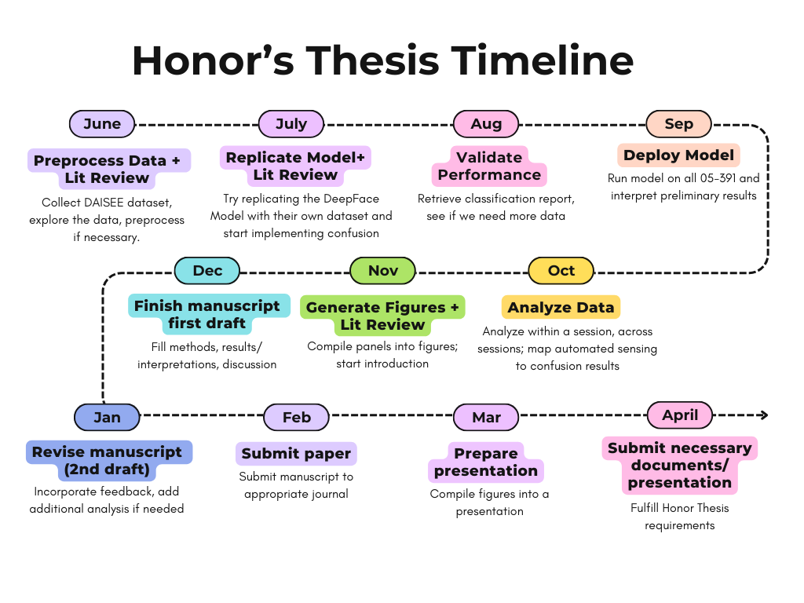

## TIMELINE


### Build a Sequential model for confused faces
### STEP 1
Since all images from each 10s clip looks about the same, we will just pick the middle one.


### STEP 2 
labels are 0-3 (see below), we will use 0 and 1 as not-confused, and 2 and 3 as confused.
```python
{0: 'very low', 
 1: 'low', 
 2: 'high', 
 3: 'very high'}
```
